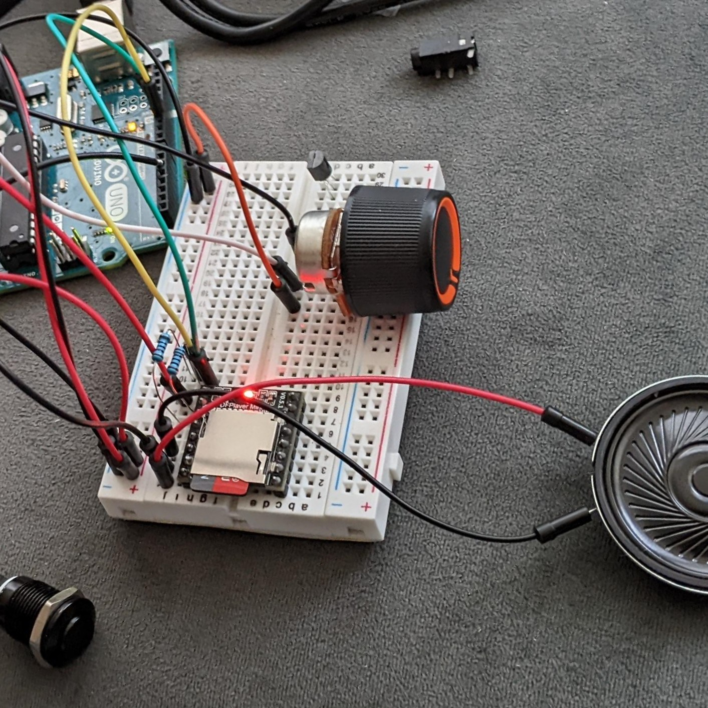
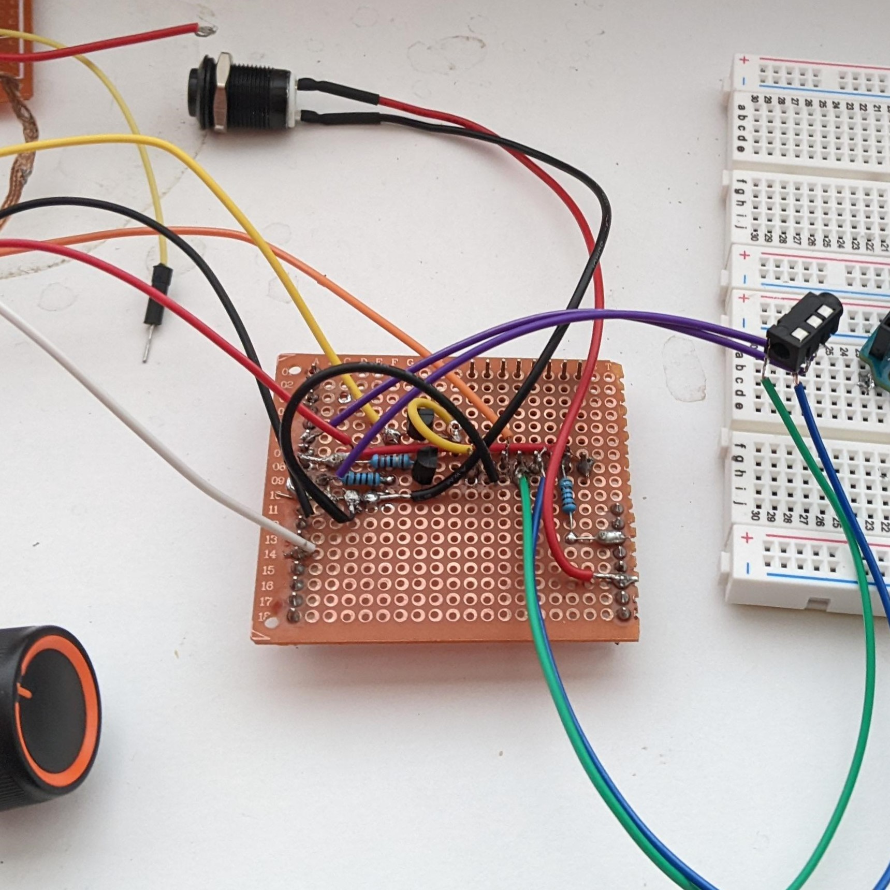
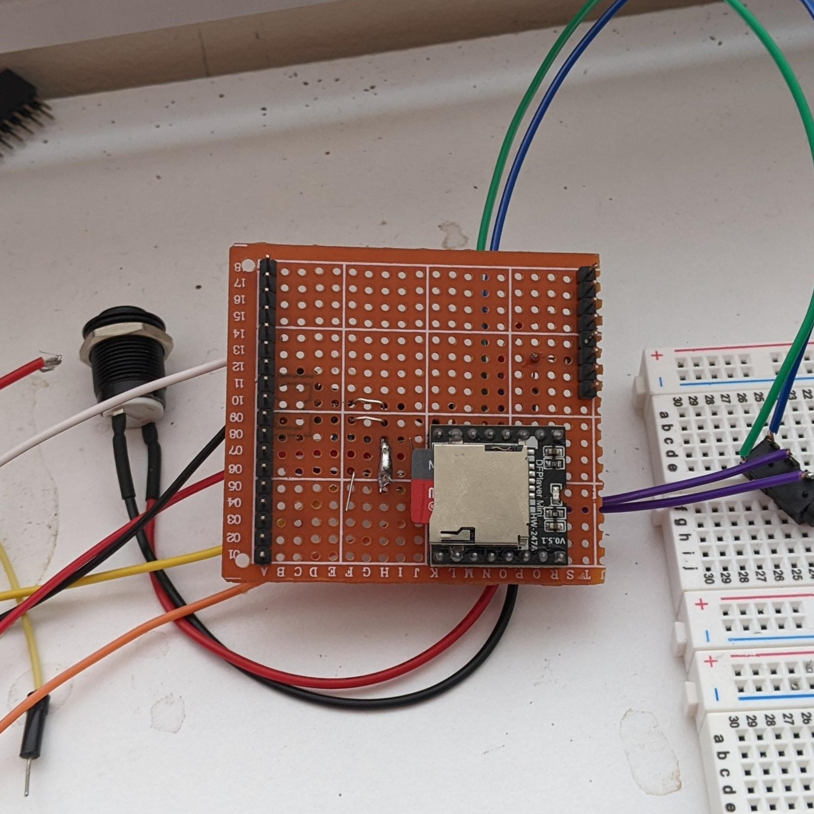
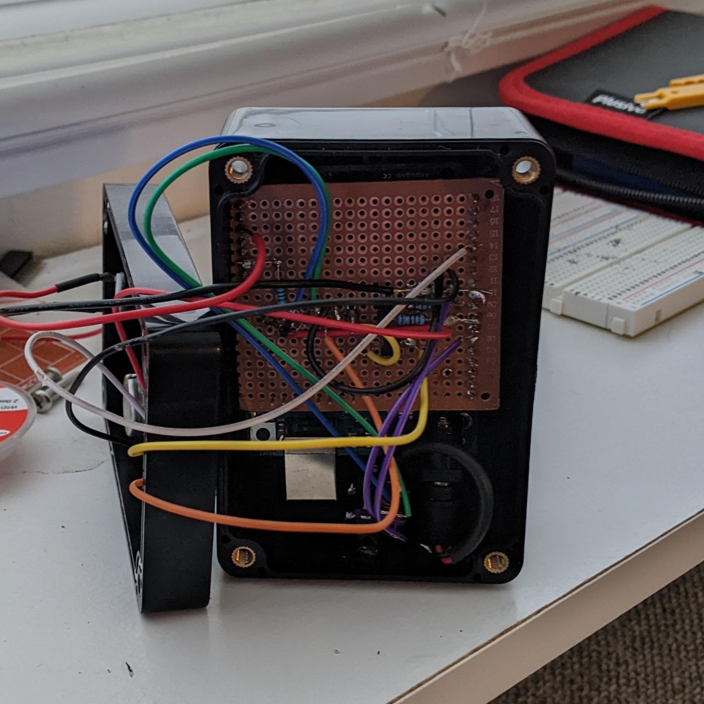
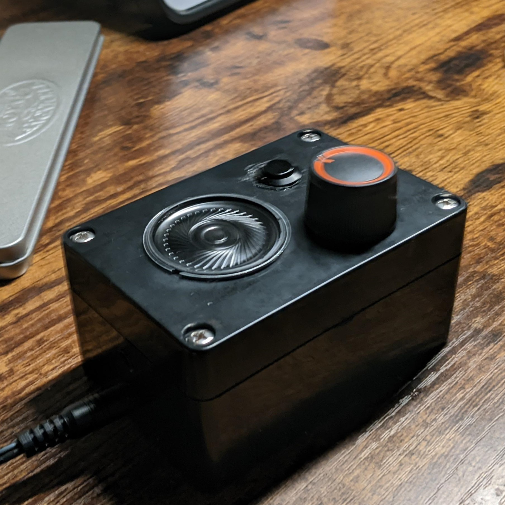

# About

This is a showcase for a standalone sound machine powered by arduino uno v3 and dfplayer mini. Different sounds are loaded onto a TF card and are cycled through by pressing an input button.

## Arduino

Arduino code is available is in [main.ino](main.ino).

The board does serial communication with dfplayer mini. [See wiki](https://wiki.dfrobot.com/DFPlayer_Mini_SKU_DFR0299).

## Noise

A noise generating script is available in [noises/generate.py](noises/generate.py). It generates white, pink, blue, violet, and red (brownian) noise. There is also a makefile to automatically generate and convert to mp3 (required format for dfplayer mini).

## Extra sounds

More audio tracks are included in the [sounds/](sounds/) directory. These were collected from www.pixabay.com, and then edited individually to seemlessly loop.

## Showcase

### Prototype

### Breadboard 1

### Breadboard 2

### Assembly

### Final

